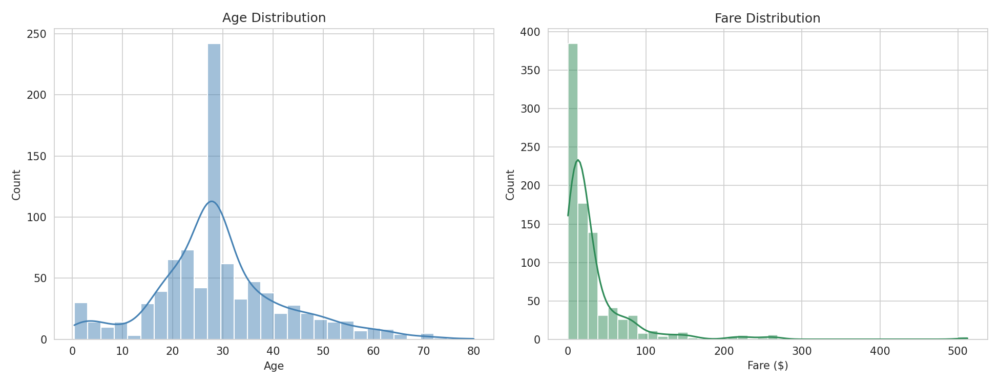
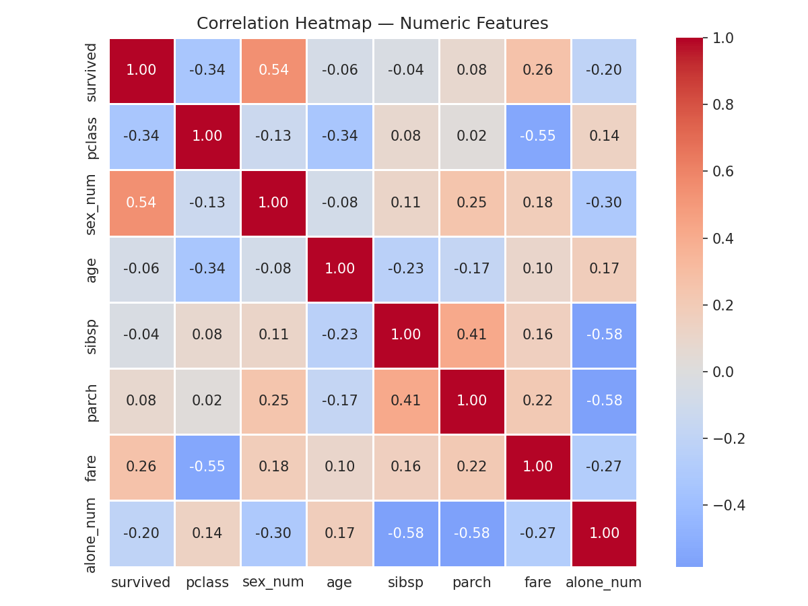
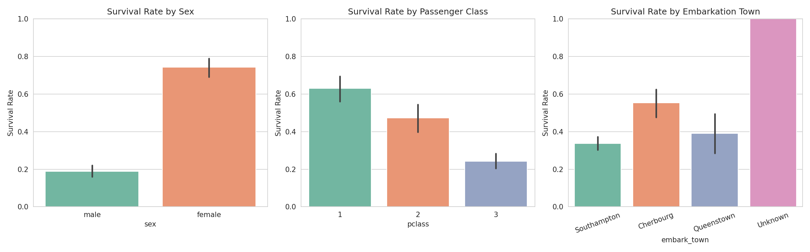
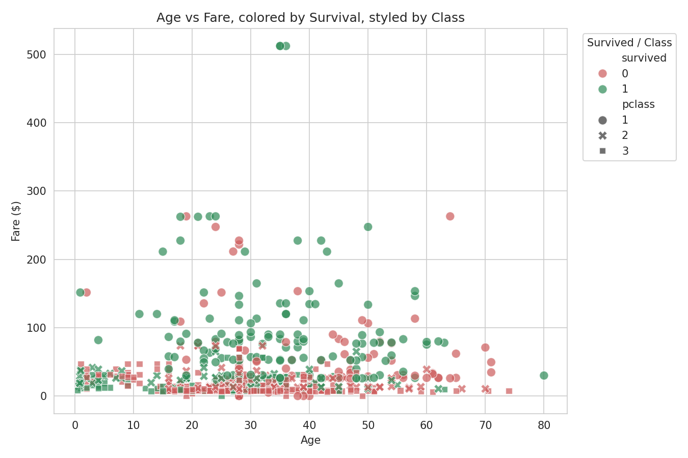
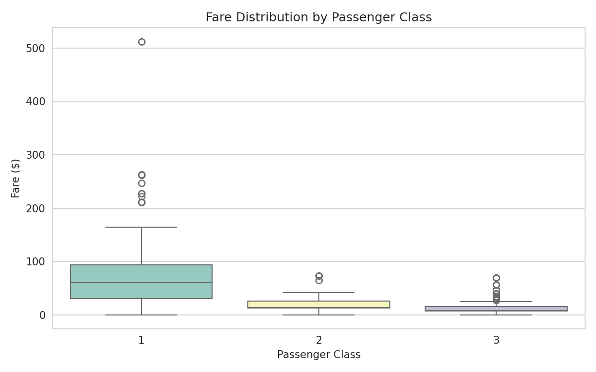

# Exploratory Data Analysis Report
## Titanic Passenger Survival — Patterns and Influencing Factors

---

## 1. Executive Summary

This analysis explores the Titanic passenger manifest (891 passengers) to
identify which factors were most strongly associated with survival. The
overall survival rate was **38.4%**. The two strongest influencing factors
were **sex** and **passenger class**, with fare paid also showing a
moderate positive relationship with survival — consistent with the
historical account that women, children, and first-class passengers were
prioritized during evacuation.

---

## 2. Dataset Overview

| Property | Value |
|---|---|
| Source | Titanic passenger manifest (seaborn-data) |
| Rows | 891 passengers |
| Columns | 15 (numeric + categorical) |
| Target of interest | `survived` (0 = did not survive, 1 = survived) |

**Key fields used in this analysis:** `survived`, `pclass` (ticket class),
`sex`, `age`, `sibsp` (siblings/spouses aboard), `parch` (parents/children
aboard), `fare`, `embark_town`.

### Missing data

| Column | Missing | % Missing |
|---|---|---|
| `deck` | 688 | 77.2% |
| `age` | 177 | 19.9% |
| `embarked` / `embark_town` | 2 | 0.2% |

`deck` is missing for the large majority of records and was excluded from
quantitative analysis. `age` was imputed with the median (28) for
visualization purposes only — a method chosen for simplicity here;
a more rigorous project would consider group-wise imputation (e.g., median
age by passenger class) or a model-based approach.

---

## 3. Statistical Summary

| Metric | Age | Fare | Siblings/Spouses | Parents/Children |
|---|---|---|---|---|
| Mean | 29.7 | $32.20 | 0.52 | 0.38 |
| Median | 28.0 | $14.45 | 0 | 0 |
| Std. Dev. | 14.5 | $49.69 | 1.10 | 0.81 |
| Min | 0.42 | $0.00 | 0 | 0 |
| Max | 80.0 | $512.33 | 8 | 6 |

**Observation:** Fare is heavily right-skewed (mean $32 vs. median $14.45,
max $512) — a small number of passengers paid very high fares, pulling the
average up. Most fields for family size (`sibsp`, `parch`) are 0 for the
majority of passengers, indicating most travelers were alone.

---

## 4. Correlation Analysis

Correlation of each numeric factor with survival (Pearson's r):

| Factor | Correlation with Survival | Direction |
|---|---|---|
| Sex (female = 1) | **+0.543** | Strong positive |
| Passenger class | **-0.338** | Moderate negative |
| Fare | +0.257 | Weak–moderate positive |
| Traveling alone | -0.203 | Weak negative |
| Parents/children aboard | +0.082 | Negligible |
| Age | -0.065 | Negligible |
| Siblings/spouses aboard | -0.035 | Negligible |

**Interpretation:**
- **Sex** is by far the strongest single predictor of survival in this
  dataset — being female correlates strongly with survival.
- **Passenger class** has a negative correlation because class is coded
  1 (best) to 3 (worst) — so the negative sign means higher-numbered
  (lower) classes had lower survival.
- **Fare** correlates positively with survival, but this is likely not
  causal on its own — fare is closely tied to class (see Section 6),
  so this is probably capturing the same effect as class rather than an
  independent one.
- **Age**, **family size**, and **traveling alone** show only weak
  relationships with survival on their own, though age matters more when
  combined with sex (see Section 5) — young boys in third class, for
  instance, fared differently than young girls.

---

## 5. Key Findings by Group

| Breakdown | Survival Rate |
|---|---|
| Female | 74.2% |
| Male | 18.9% |
| 1st Class | 63.0% |
| 2nd Class | 47.3% |
| 3rd Class | 24.2% |
| Embarked Cherbourg | 55.4% |
| Embarked Queenstown | 39.0% |
| Embarked Southampton | 33.7% |

**Note on embarkation:** the "Unknown" embarkation group shows a 100%
survival rate in the chart, but this reflects only 2 passengers with
missing embarkation data — both happened to survive. This is a small-sample
artifact, not a meaningful pattern, and should not be interpreted as a
finding.

The gap between male and female survival rates (18.9% vs. 74.2%, a
**55-point difference**) is the single largest gap of any factor examined,
and is consistent with the historical "women and children first" evacuation
protocol.

---

## 6. Multivariate Patterns

Plotting age against fare, colored by survival and styled by class, shows
that survivors (green) cluster more heavily among higher fares — reinforcing
that fare and class jointly separate survivors from non-survivors, more so
than age alone. Non-survivors (red) are spread more evenly across the full
age range, especially concentrated at lower fares.

This boxplot confirms fare and class are closely linked: first-class fares
have a much higher median and wider spread (including the highest outliers,
up to $512), while third-class fares cluster tightly near the low end. This
supports treating fare and class as related, overlapping signals rather
than fully independent ones — a model built on both would need to watch for
this redundancy (multicollinearity).

---

## 7. Conclusions

1. **Sex was the strongest influencing factor** on survival in this
   dataset, followed by **passenger class**.
2. **Fare** matters, but largely because it's a proxy for class rather than
   an independent driver.
3. **Age and family size** had only weak standalone effects, but likely
   interact with sex and class in ways a single correlation coefficient
   can't fully capture (e.g., "women and children" as a joint group).
4. Missing data was concentrated in `deck` (77%) and `age` (20%) — any
   downstream modeling should account for this, either through imputation
   strategy or by treating "missingness" itself as a potential signal.

## 8. Suggested Next Steps

- Build a predictive model (e.g., logistic regression or random forest) to
  quantify these effects jointly rather than one at a time — see the
  companion **Predictive Modeling** project for a full workflow.
- Engineer a "family size" feature (`sibsp` + `parch`) to test whether
  small families survived at different rates than solo travelers or large
  families.
- Investigate the `deck` field further despite its high missingness — cabin
  location may correlate with proximity to lifeboats.
- Test statistical significance of the group differences (e.g., chi-square
  test for sex vs. survival) rather than relying on correlation alone.
